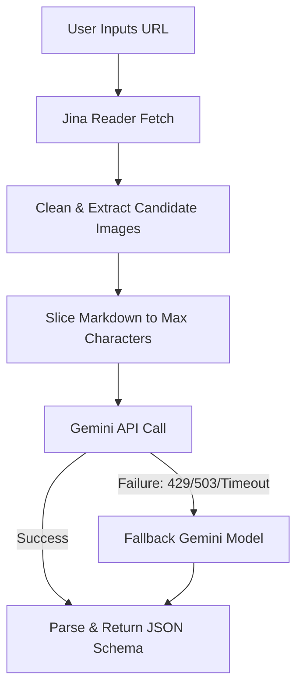

# AI Autofill Pipeline: Jina & Gemini Integration

This document outlines the current data flow and integration details of the AI Autofill features (Product autofill and Vendor enrichment) within the CRM dashboard application.

---

## 1. Web Scraping with Jina Reader

Jina Reader converts arbitrary target web pages into clean, LLM-friendly Markdown snapshots.

* **API Endpoint**: `https://r.jina.ai/{TargetUrl}` (configured as `SCRAPER_CONFIG.jinaReaderUrl`).
* **Authentication**: Sends the `Authorization: Bearer <JINA_API_KEY>` header if configured in the server environment variables.
* **Timeout**: Set to 20 seconds.
* **Markdown Cleaning**: The application strips tracking URLs, cookies, and boilerplate scripts from the returned text to reduce context bloat.
* **Slicing/Length Limit**: Truncates the cleaned Markdown to the first 100,000 characters (`SCRAPER_CONFIG.maxCharacters`) before feeding it to the Gemini prompt context.

---

## 2. Candidate Image Extraction

Before calling Gemini, a best-effort, multi-strategy local parser extracts potential image URLs in parallel:

* **Sources**: Extracts URLs from:
  1. Standard Markdown images ``
  2. Raw HTML `` source attributes
  3. Standard file extensions (`.jpg`, `.png`, `.webp`, etc.) and keywords (e.g. `product`, `image`, `media`)
  4. Server-side fetched raw HTML tags (e.g., `<meta property="og:image">`, favicon link tags, and Schema.org `ld+json` logos).
* **Filtering & Ranking**: Filters out tracking pixels, loading spinners, and navigation SVGs. It limits the lists to `SCRAPER_CONFIG.maxImageCandidates` (15 candidates) and ranks them (e.g., OG and Schema meta first) before supplying them to the Gemini model.

---

## 3. Gemini LLM Query & Fallback Mechanism

Once the cleaned Markdown and candidate images are prepared, they are packed into a prompt instructions template and sent to the LLM.

### Transparent Fallback Flow
Requests are handled by `fetchGeminiWithFallback` in [ai-actions.ts](file:///c:/Users/rolys/Web/SDG/apps/dashboard/src/server/ai-actions.ts#L43-L91):
1. **Primary Model**: Sends payload to `SCRAPER_CONFIG.primaryModel` (`gemini-3.5-flash`).
2. **Detection**: Listens for HTTP `429` (Rate Limit), `503` (Service Unavailable), or request timeouts.
3. **Fallback Trigger**: If the primary model fails or times out, it transparently resends the exact same payload to `SCRAPER_CONFIG.fallbackModel` (`gemini-2.5-flash`).

### Prompt Constraints
The prompt instructs the model to return a structured JSON response matching the target entity schema (Product or Vendor):
* **Schema Enforcement**: Employs `generationConfig.responseSchema` to guarantee strict JSON type compliance.
* **Security Constraints**: Strictly forbids base64 data URLs, requires absolute HTTPS URLs for images, and asks the model to output confidence levels for each extracted attribute.
