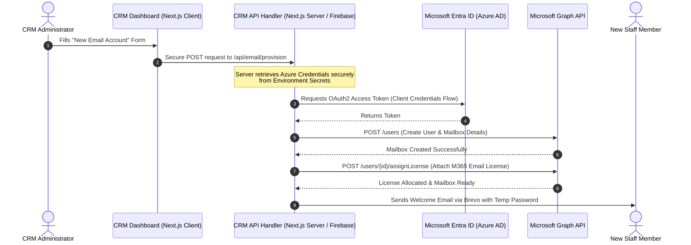

# GoDaddy / Microsoft 365 Email Integration Architecture

This collaboration document outlines the blueprint for integrating domain-based custom email account creation, metadata updates, and licensing management directly into the Sarvian Design Group CRM.

---

## 1. Architectural Overview

Since GoDaddy Business Email utilizes Microsoft 365 (Office 365) infrastructure behind the scenes, we can connect our CRM server-side code to the official **Microsoft Graph API**. This guarantees a secure, highly scalable, and native integration.

Below is the design workflow showing how a mailbox is provisioned from the CRM:

---

## 2. Phase-by-Phase Integration Plan

We propose a structured approach divided into four digestible stages:

### Phase 1: OAuth2 App Registration in Microsoft Entra (Azure AD)

To make authorized calls, we will register the SDG CRM inside the Microsoft Azure portal connected to your email tenant:

- **Service Account Mode**: We'll configure **Application Permissions** (Client Credentials Flow) so the server can provision mailboxes directly without requiring a browser login popup from the administrator.
- **Scope Permissions**:
  - `User.ReadWrite.All` (To create, list, and disable email accounts)
  - `Directory.ReadWrite.All` (To assign domains and security parameters)
  - `Organization.Read.All` (To verify available licenses)

### Phase 2: Secure Server-Side Integration

Since client-side keys must never be exposed, we will construct secure endpoints under `apps/dashboard/src/app/api/email/`:

- **`GET /api/email/accounts`**: Fetches current email directory, active usage, and status.
- **`POST /api/email/create`**: Payload handles:
  - First / Last Name
  - Target Email prefix (e.g., `robert@sarviandg.com`)
  - Target Password (automatically generated or custom)
- **Token Cache Manager**: To prevent rate-limiting, the server will cache the Microsoft access token until its standard 1-hour expiration.

### Phase 3: Premium Management User Interface

We will build a high-performance **"Domain & Email Manager"** tab inside the dashboard:

- **Overview Stat Cards**: Total active mailboxes, available unused licenses, and primary domain records.
- **Interactive Data Table**: Searchable list of active accounts, display names, secondary aliases, and mailbox size alerts.
- **Provisioning Dialog**: A premium, step-by-step modal for creating a new custom email, with full form validations.
- **Quick Action Triggers**: Instant buttons for "Reset Password", "Forwarding Address", and "Disable Mailbox".

---

## 3. Collaboration & Open Questions

To align on the best implementation, let's explore these important details together:

> [!IMPORTANT]
> **1. Confirming Microsoft 365 Backend**
> Can you log in to your email by going to **office.com** or **outlook.office.com** using your GoDaddy email credentials? If so, this confirms you are on the Microsoft 365 tenant, and we can use the Microsoft Graph API.

> [!TIP]
> **2. GoDaddy License Management Flow**
> When creating a new email, the CRM needs to assign an available email license (e.g., _Microsoft 365 Business Basic_).
>
> - **Recommended Approach**: We design the CRM to check if you have any _unallocated_ licenses already purchased in your GoDaddy account. If yes, it allocates it to the new email. If no, the CRM will instruct the Admin to buy another license seat inside their GoDaddy Console first before provisioning.
> - **Automated Purchase alternative**: We can use GoDaddy's Reseller/Billing API to charge your card and buy license seats automatically, though this is much more complex and usually unnecessary compared to the recommended approach.

> [!NOTE]
> **3. User Welcome Notification**
> Once the mailbox is successfully provisioned, should the CRM send the new user's temporary login credentials to their **personal alternative email** (e.g. gmail/yahoo) via Brevo, or should the Admin copy it directly from the screen?

---

Please review this design and let me know your thoughts on the points above! We can start implementing Phase 1 and 2 as soon as you're ready.
