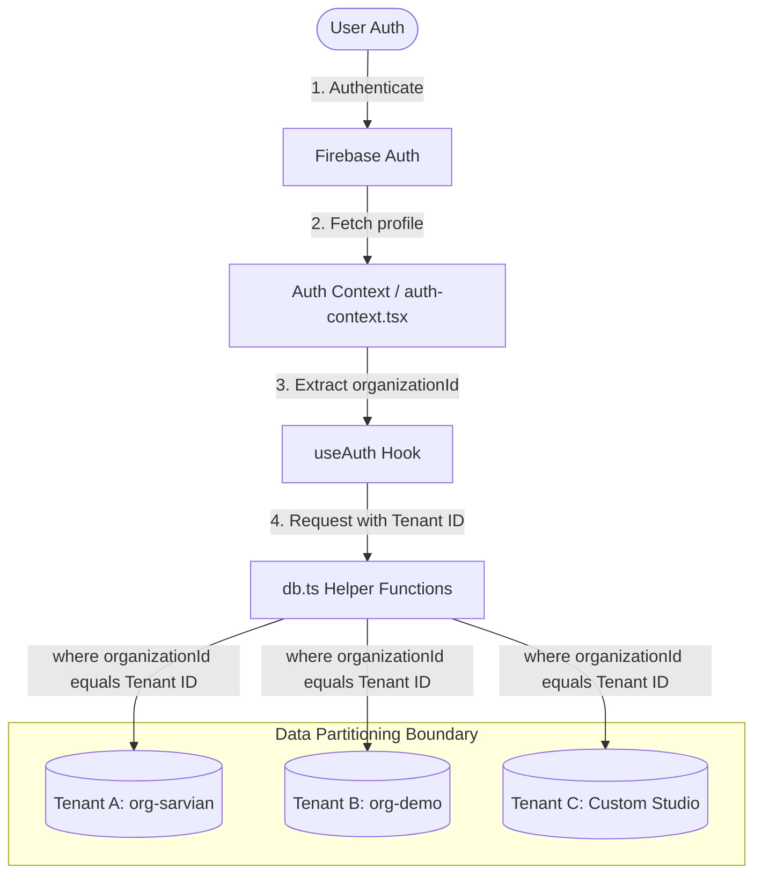
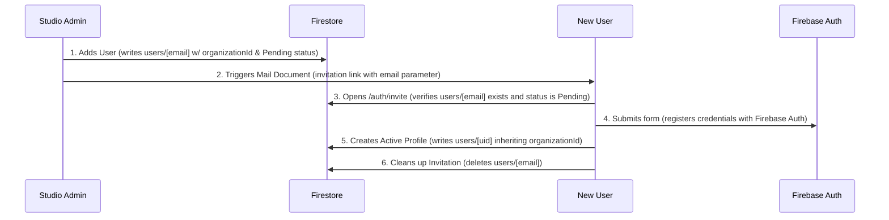

# SaaS Multi-Tenancy & Architecture Guide

This document provides a comprehensive blueprint of the multi-tenant SaaS architecture implemented in the Sarvian Design Group (SDG) CRM application. It outlines what was recently completed, the structure of the SaaS system, database schemas, and how data isolation, user onboarding, and access control are enforced across the workspace.

---

## 1. Summary of Recent Implementation

To prepare this dashboard application for production commercialization, we transitioned it from a single-studio sandbox into a secure, multi-tenant Software-as-a-Service (SaaS) platform:

1. **Multi-Tenancy Database Partitioning**: Added `organizationId` fields to all key database models and updated query utilities to filter and write records strictly inside their tenant partition.
2. **Tenant Onboarding & Invitation Workflows**: Refactored the administrator-driven user directory. Invited members inherit the admin's `organizationId` and receive an email invitation to activate their account.
3. **Data Isolation Security**: Enforced checks in the user profiles, settings, and team directories to prevent cross-tenant enumeration or edits. Restricted default mock seeding to the sales demo tenant (`org-demo`).
4. **Performance & Stability Tuning**: Fixed an infinite connection check loop in Google Analytics 4 (GA4) integration that was causing network socket exhaustion and server crashes (`ECONNRESET`).
5. **Invite Session Activation Fix**: Corrected a profile setup bug in the invite page to ensure the tenant's identifier (`organizationId`) is permanently written to their authenticated Firestore document upon account activation.
6. **Org-Scoped Security Rules** _(2026-06-12)_: Replaced the expiring test-mode Firestore/Storage rules with authenticated, organization-partitioned rules (`apps/dashboard/firestore.rules`, `storage.rules`). Server-side enforcement now backs every client-side check.
7. **Invite-Only Access Enforcement** _(2026-06-12)_: Removed the `org-demo` safe-fallback for uninvited sign-ups. Accounts without a matching pending invite are signed out; the security rules make profile self-creation impossible without one.
8. **Per-Tenant Analytics (GA4)** _(2026-06-12)_: GA4 authentication moved from a personal OAuth refresh token to a Google Cloud service account, and the analytics dashboard now resolves each tenant's own GA4 property from their organization's configuration via the Firebase Admin SDK.

---

## 2. Multi-Tenant SaaS Architecture

The application is structured around a **logical data separation model** using a shared Firebase Firestore database and Firebase Storage bucket, partitioned by an `organizationId`.

### Data Isolation & Access Flow



---

## 3. Core SaaS Subsystems

### A. Authentication & Session Management

All authentication and profile hydration logic is centralized on the client via React Context.

- **`auth-context.tsx`**: Declares the `AuthProvider` which wraps the dashboard layout.
  - Subscribes to Firebase Auth session updates (`onAuthStateChanged`).
  - Sets up a real-time listener (`onSnapshot`) to the user's document in the `users` Firestore collection (keyed by their Firebase Auth `uid`).
  - Exposes the `user` object, the hydrated `profile` (including their `organizationId` and `role`), and a `loading` state to prevent layout flashes.
  - Writes the `active-organization-id` cookie (name shared via `lib/org-cookie.ts`) when a valid profile loads, and clears it on sign-out. Server actions read this cookie to resolve tenant-scoped configuration (see Section 5).
  - Treats a profile **missing its `organizationId` as unauthorized**: no profile is exposed and the org cookie is cleared, so a broken account can never inherit another tenant's context.
- **`auth-guard.tsx`**: Restricts access to dashboard paths.
  - If a user is not authenticated, they are redirected to `/auth/login`.
  - Automatically updates the user's `lastActive` timestamp in Firestore on page transitions.
  - Converts pending invitations for registering users. If an authenticated account has **no profile and no pending invite**, it is signed out with an explanatory toast — access is strictly invite-only.

### B. Database Partitioning (`db.ts`)

Queries in `db.ts` enforce the tenant boundary by requiring `organizationId` on all reads and writes.

```typescript
// Example: Partitioned query in db.ts
export async function getClients(organizationId: string): Promise<Client[]> {
  try {
    const collRef = collection(db, "clients");
    const q = query(collRef, where("organizationId", "==", organizationId));
    const filteredSnapshot = await getDocs(q);

    const clients: Client[] = [];
    filteredSnapshot.forEach((doc) => {
      clients.push(doc.data() as Client);
    });
    return clients.sort((a, b) => b.createdAt - a.createdAt);
  } catch (error) {
    console.error("Error fetching clients:", error);
    return [];
  }
}
```

_Note: If no records exist in `clients`, `vendors`, `projects`, or `library` when queried under a tenant, the database only triggers mock data seeding if the requesting tenant is `org-demo`, keeping other tenants clean._

### C. Role-Based Access Control (RBAC)

User permissions are determined by the `role` field on their `UserProfile` document:

- **`SuperAdmin`**: Global manager (system-wide actions, billing, dashboard monitoring).
- **`Admin`**: Studio owner/manager (can invite team members, manage active user accounts, customize company preferences).
- **`Contributor`**: Team member (can create and edit projects, vendors, clients, library items, and proposals).

Access restrictions are evaluated on the client (e.g., blocking navigation to `/dashboard/users` for non-Admins) and **enforced server-side by the published Firestore security rules** (see Section 4) — client checks are UX, the rules are the security boundary.

### D. Invitation & Tenant Onboarding Flow

To prevent public sign-ups during the launch phase, new users can only join by being invited by an Admin or a SuperAdmin.



#### Step-by-Step Sequence:

1. **Invite Creation**: An Admin enters a name and email in the team directory `/dashboard/users`. This creates a document in the `users` collection keyed by the user's lowercase email address:
   ```json
   {
     "fullName": "Jane Doe",
     "email": "jane@example.com",
     "role": "Contributor",
     "status": "Pending",
     "organizationId": "org-sarvian"
   }
   ```
2. **Invitation Email**: Writing this document triggers the Firestore Trigger Email extension, which sends an onboarding email containing a link to `/auth/invite?email=jane@example.com`.
3. **Registration & Profile Setup**: When the invitee clicks the link, they are directed to the custom registration form. On submission:
   - Firebase Auth creates their credentials.
   - A permanent active user document is written in Firestore, keyed by their authenticated `uid`, copying the `role` and `organizationId` from the pending invite.
   - The temporary invite document keyed by their email is deleted to prevent reuse.
4. **Uninvited Sign-Ups Hard-Fail** _(replaced the former org-demo fallback on 2026-06-12)_: If someone creates a Firebase Auth account without an invite, the AuthGuard finds no profile and no pending invite, shows "This account has no invitation," and signs them out. The Firestore rules independently guarantee that a self-created profile must copy a pending invite for the requester's own email exactly (org and role) — there is no path into any organization without an invite. Note: `org-demo` still exists, but only as the SuperAdmin account's home organization, not as a fallback destination.

---

## 4. Firestore & Storage Security Rules

Published 2026-06-12, replacing the test-mode rules (which allowed public read/write and would have denied _all_ requests after their built-in expiry). The repo copies — `apps/dashboard/firestore.rules` and `apps/dashboard/storage.rules` — are the source of truth; changes are pasted into the Firebase console and published.

Key properties:

- **Authenticated + org-partitioned**: every data collection (`clients`, `vendors`, `projects`, `library`, `proposals`, `trades`) is readable/writable only by signed-in users whose profile `organizationId` matches the document's, and the org field is immutable on update (documents cannot be moved between tenants).
- **Requester identity from Firestore**: the rules resolve the caller's org/role by reading `users/{request.auth.uid}` (one cached lookup per request).
- **Parent-project scoping**: `projectRooms` (which carry no org field) and `projectRoomItems` are authorized by looking up the parent project's `organizationId`.
- **Profile protections**: users can edit their own profile but can never change their own `role` or `organizationId`; self-created profiles must exactly copy a pending invite for the requester's email.
- **Invites**: pending invite documents are readable pre-authentication by exact email (required by the invite page), creatable by Admins within their org or SuperAdmins anywhere.
- **Tenant administration**: only SuperAdmins can list/create/update `organizations`; members can read their own org document.
- **`mail`** is create-only (outbox for the Trigger Email extension); **`code`** (diagnostics) is authenticated-only; everything unlisted is denied.
- **Storage**: `library/` and `vendors/` paths require authentication; image display continues to work via tokened download URLs.
- The **Firebase Admin SDK bypasses these rules** by design — it is used only in trusted server code (Section 7).

---

## 5. Per-Tenant Analytics (GA4)

The analytics dashboard (`/dashboard/analytics`) reads live GA4 data per tenant:

1. **Authentication — service account**: `src/server/ga4.ts` authenticates the GA4 Data API with a Google Cloud service account (`GA_SERVICE_ACCOUNT_KEY` env var, raw or base64 JSON; project `designer-crm-499221`). Unlike the previous personal OAuth refresh token, service-account credentials never expire. A legacy OAuth fallback remains in code but is unused.
2. **Tenant resolution**: server actions in `analytics-actions.ts` read the `active-organization-id` cookie, fetch that organization via the Firebase Admin SDK (`src/server/firebase-admin.ts`, `FIREBASE_SERVICE_ACCOUNT_KEY` env var), and use the org's `config.gaPropertyId`. **With an org cookie present there is no env fallback** — a tenant without a configured property sees a "Setup required" state, never another tenant's data. The global `GA_PROPERTY_ID` env var applies only when no org context exists.
3. **Client onboarding routine**: enter the client's GA4 property ID in their tenant settings page (`/dashboard/tenants/[tenantId]`), and grant the service-account email Viewer access in the client's GA4 property (Admin → Property access management).
4. **Unconfigured state**: all analytics widgets render a uniform centered "Setup required" warning badge (`analytics-setup-required.tsx`); genuine API errors additionally surface details via toast.

_Security note (Stage 4, pending)_: the org cookie is client-controlled and acceptable while only the operator has accounts; before client users receive logins, server actions must verify a Firebase ID token instead of trusting the cookie.

---

## 6. Vendor Image Self-Hosting (Mirroring System)

To prevent mixed-content warnings, bypass CORS issues, and protect vendor images from disappearing if external host URLs change, the application mirrors and self-hosts logo and banner assets:

1. **Protocol Normalization**: External candidate image URLs returned by the AI crawler are normalized from `http://` to `https://`.
2. **High-Resolution Selection**: Image suffix sizes (e.g. `_170x`, `_large`) are stripped from candidates to obtain the highest resolution original image before evaluations are sent to Gemini.
3. **Server-Side Fetching**: A server-side helper (`vendor-image-mirror.ts`) fetches the external image to bypass browser CORS restrictions and streams it as a file block.
4. **Firebase Storage Hosting**: The image is uploaded to Firebase Storage under organized, tenant-agnostic paths (`vendors/logos/` and `vendors/heroes/`). The public download URL is written back to the vendor's Firestore document.

---

## 7. Directory Layout & File Guide

Below is the directory guide for the SaaS modules:

```text
apps/dashboard/
├── firestore.rules                       # Org-scoped Firestore security rules (source of truth)
├── storage.rules                         # Storage rules for library/vendor image paths
└── src/
    ├── app/(main)/
    │   ├── auth/
    │   │   ├── invite/page.tsx           # Invitation sign-up & account activation form
    │   │   └── login/page.tsx            # Secure sign-in boundary
    │   └── dashboard/
    │       ├── analytics/                # Per-tenant GA4 dashboard (5 tabs + setup states)
    │       ├── tenants/                  # SuperAdmin org management (incl. gaPropertyId config)
    │       ├── users/
    │       │   └── _components/users.tsx # Admin dashboard team directory & invite controls
    │       └── profile/page.tsx          # Tenant-isolated user profile settings
    ├── components/
    │   ├── auth-context.tsx              # Global useAuth() provider, Firebase Auth listeners, org cookie
    │   └── auth-guard.tsx                # Invite conversion, invite-only enforcement, route protection
    ├── lib/
    │   ├── db.ts                         # Partitioned Firestore read/write handlers
    │   ├── org-cookie.ts                 # Shared active-organization-id cookie name
    │   ├── types.ts                      # SaaS data models (UserProfile, Organization, etc.)
    │   └── vendor-image-mirror.ts        # Server-side proxy and Firebase image uploads
    └── server/
        ├── analytics-actions.ts          # GA4 server actions w/ per-tenant property resolution
        ├── firebase-admin.ts             # Admin SDK Firestore client (bypasses rules; server-only)
        └── ga4.ts                        # GA4 Data API client (service-account auth)
```
