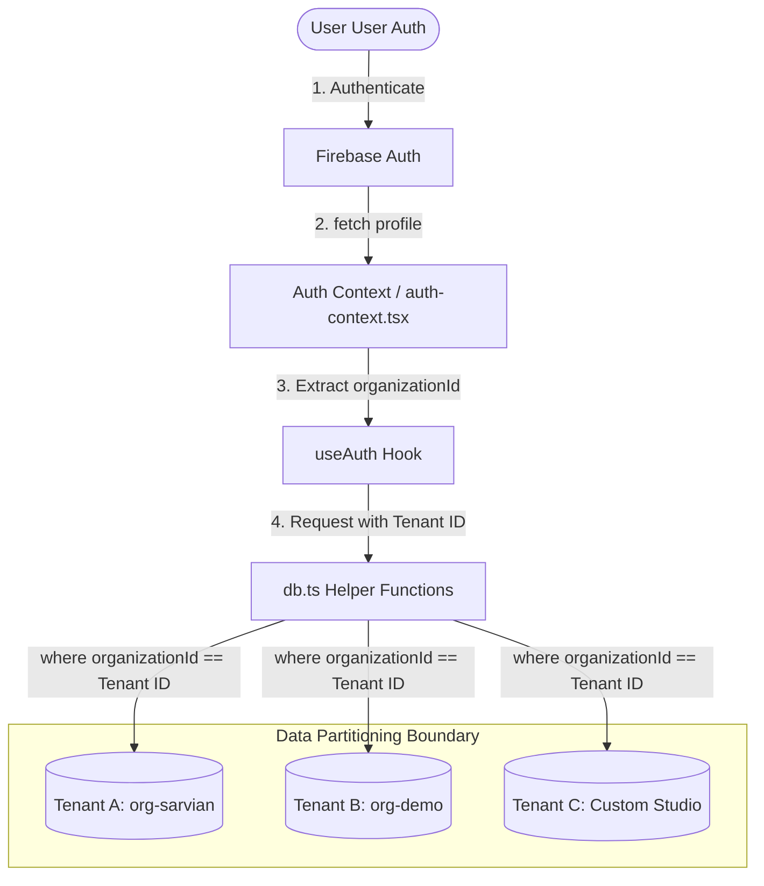
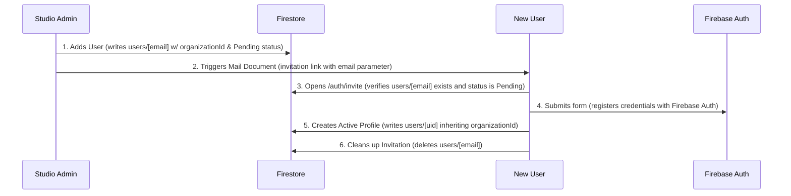

# SaaS Multi-Tenancy & Architecture Guide

This document provides a comprehensive blueprint of the multi-tenant SaaS architecture implemented in the Sarvian Design Group (SDG) CRM application. It outlines what was recently completed, the structure of the SaaS system, database schemas, and how data isolation, user onboarding, and access control are enforced across the workspace.

---

## 1. Summary of Recent Implementation

To prepare this dashboard application for production commercialization, we transitioned it from a single-studio sandbox into a secure, multi-tenant Software-as-a-Service (SaaS) platform:

1. **Multi-Tenancy Database Partitioning**: Added `organizationId` fields to all key database models and updated query utilities to filter and write records strictly inside their tenant partition.
2. **Tenant Onboarding & Invitation Workflows**: Refactored the administrator-driven user directory. Invited members inherit the admin's `organizationId` and receive an email invitation to activate their account.
3. **Data Isolation Security**: Enforced checks in the user profiles, settings, and team directories to prevent cross-tenant enumeration or edits. Restricted default mock seeding to the sales demo tenant (`org-demo`).
4. **Performance & Stability Tuning**: Fixed an infinite connection check loop in Google Analytics 4 (GA4) integration that was causing network socket exhaustion and server crashes (`ECONNRESET`).
5. **Invite Session Activation Fix**: Corrected a profile setup bug in the invite page to ensure the tenant's identifier (`organizationId`) is permanently written to their authenticated Firestore document upon account activation.

---

## 2. Multi-Tenant SaaS Architecture

The application is structured around a **logical data separation model** using a shared Firebase Firestore database and Firebase Storage bucket, partitioned by an `organizationId`.

### Data Isolation & Access Flow



---

## 3. Core SaaS Subsystems

### A. Authentication & Session Management
All authentication and profile hydration logic is centralized on the client via React Context.

- **`auth-context.tsx`**: Declares the `AuthProvider` which wraps the dashboard layout.
  - Subscribes to Firebase Auth session updates (`onAuthStateChanged`).
  - Sets up a real-time listener (`onSnapshot`) to the user's document in the `users` Firestore collection (keyed by their Firebase Auth `uid`).
  - Exposes the `user` object, the hydrated `profile` (including their `organizationId` and `role`), and a `loading` state to prevent layout flashes.
- **`auth-guard.tsx`**: Restricts access to dashboard paths.
  - If a user is not authenticated, they are redirected to `/auth/login`.
  - Automatically updates the user's `lastActive` timestamp in Firestore on page transitions.
  - Converts pending invitations for registering users.

### B. Database Partitioning (`db.ts`)
Queries in `db.ts` enforce the tenant boundary by requiring `organizationId` on all reads and writes.

```typescript
// Example: Partitioned query in db.ts
export async function getClients(organizationId: string): Promise<Client[]> {
  try {
    const collRef = collection(db, "clients");
    const q = query(collRef, where("organizationId", "==", organizationId));
    const filteredSnapshot = await getDocs(q);

    const clients: Client[] = [];
    filteredSnapshot.forEach((doc) => {
      clients.push(doc.data() as Client);
    });
    return clients.sort((a, b) => b.createdAt - a.createdAt);
  } catch (error) {
    console.error("Error fetching clients:", error);
    return [];
  }
}
```

*Note: If no records exist in `clients`, `vendors`, `projects`, or `library` when queried under a tenant, the database only triggers mock data seeding if the requesting tenant is `org-demo`, keeping other tenants clean.*

### C. Role-Based Access Control (RBAC)
User permissions are determined by the `role` field on their `UserProfile` document:
- **`SuperAdmin`**: Global manager (system-wide actions, billing, dashboard monitoring).
- **`Admin`**: Studio owner/manager (can invite team members, manage active user accounts, customize company preferences).
- **`Contributor`**: Team member (can create and edit projects, vendors, clients, library items, and proposals).

Access restrictions are evaluated on both the client (e.g., blocking navigation to `/dashboard/users` for non-Admins) and reinforced via Firestore security rules on write operations.

### D. Invitation & Tenant Onboarding Flow

To prevent public sign-ups during the launch phase, new users can only join by being invited by an Admin or a SuperAdmin.



#### Step-by-Step Sequence:
1. **Invite Creation**: An Admin enters a name and email in the team directory `/dashboard/users`. This creates a document in the `users` collection keyed by the user's lowercase email address:
   ```json
   {
     "fullName": "Jane Doe",
     "email": "jane@example.com",
     "role": "Contributor",
     "status": "Pending",
     "organizationId": "org-sarvian"
   }
   ```
2. **Invitation Email**: Writing this document triggers the Firestore Trigger Email extension, which sends an onboarding email containing a link to `/auth/invite?email=jane@example.com`.
3. **Registration & Profile Setup**: When the invitee clicks the link, they are directed to the custom registration form. On submission:
   - Firebase Auth creates their credentials.
   - A permanent active user document is written in Firestore, keyed by their authenticated `uid`, copying the `role` and `organizationId` from the pending invite.
   - The temporary invite document keyed by their email is deleted to prevent reuse.
4. **Safe Fallback**: If a user manages to register directly at `/auth/login` without an invite, the system automatically redirects them to a safe, isolated demo sandbox (`org-demo`) under the `Contributor` role to prevent unauthorized data access.

---

## 4. Vendor Image Self-Hosting (Mirroring System)
To prevent mixed-content warnings, bypass CORS issues, and protect vendor images from disappearing if external host URLs change, the application mirrors and self-hosts logo and banner assets:

1. **Protocol Normalization**: External candidate image URLs returned by the AI crawler are normalized from `http://` to `https://`.
2. **High-Resolution Selection**: Image suffix sizes (e.g. `_170x`, `_large`) are stripped from candidates to obtain the highest resolution original image before evaluations are sent to Gemini.
3. **Server-Side Fetching**: A server-side helper (`vendor-image-mirror.ts`) fetches the external image to bypass browser CORS restrictions and streams it as a file block.
4. **Firebase Storage Hosting**: The image is uploaded to Firebase Storage under organized, tenant-agnostic paths (`vendors/logos/` and `vendors/heroes/`). The public download URL is written back to the vendor's Firestore document.

---

## 5. Performance Loop Resolution (GA4 Fix)
A critical issue occurred in `<GA4ConnectionChecker>` where the React effect was refreshing the page status indefinitely, causing database connection timeouts (`ECONNRESET`):

- **The Bug**: The connection test function (`checkConnection`) was declared as an inline async block. Placing it in the dependency array of `useEffect` caused the effect to trigger on every render. Because the action updated local state, it forced a re-render, creating an infinite API connection loop.
- **The Fix**: Wrapped the helper in a `useCallback` hook with an empty dependency array. This guarantees that `checkConnection` maintains a stable reference across renders, so the loading effect only runs once when the component mounts.

---

## 6. Directory Layout & File Guide

Below is the directory guide for the SaaS modules:

```text
apps/dashboard/src/
├── app/(main)/
│   ├── auth/
│   │   ├── invite/page.tsx               # Invitation sign-up & account activation form
│   │   └── login/page.tsx                # Secure sign-in boundary
│   └── dashboard/
│       ├── users/
│       │   └── _components/users.tsx     # Admin dashboard team directory & invite controls
│       └── profile/page.tsx              # Tenant-isolated user profile settings
├── components/
│   ├── auth-context.tsx                  # Global useAuth() provider and Firebase Auth listeners
│   └── auth-guard.tsx                    # Onboarding conversion, route protection, & activity syncing
├── lib/
│   ├── db.ts                             # Partitioned Firestore read/write handlers
│   ├── types.ts                          # SaaS data models (UserProfile, Clients, Vendors, etc.)
│   └── vendor-image-mirror.ts            # Server-side proxy and Firebase image uploads
└── server/
    └── analytics-actions.ts              # GA4 credential and connection test API actions
```
