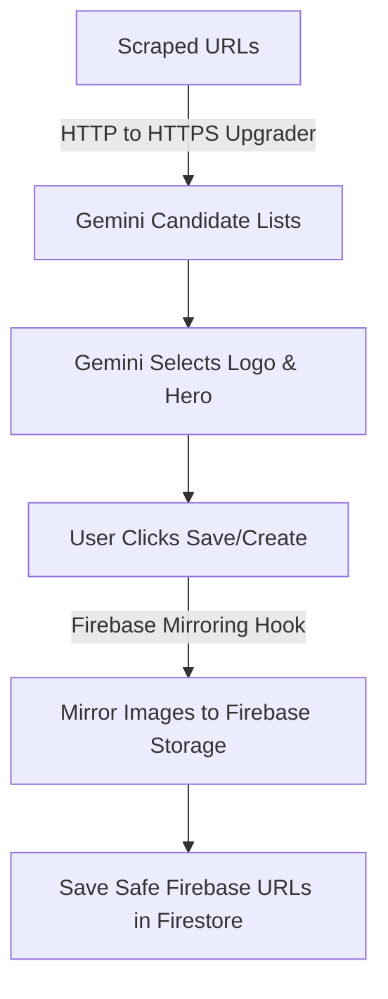

# Implementation Plan: Vendor Image Mirroring & HTTPS Normalization

This document outlines the proposed changes to ensure vendor logo and hero images are securely hosted on Firebase Storage and that non-secure `http://` CDN URLs do not cause Gemini extraction failures.

---

## Proposed Architecture Flow



---

## Detailed Components

### 1. HTTP to HTTPS URL Normalization (AI Scraper)
* **Goal**: Prevent Gemini from skipping valid assets that happen to be extracted with the `http://` protocol.
* **Proposed Change**: In [ai-actions.ts](file:///c:/Users/rolys/Web/SDG/apps/dashboard/src/server/ai-actions.ts), update `resolveAbsoluteUrl` to automatically upgrade protocol references:
```diff
 function resolveAbsoluteUrl(href: string, base: string): string {
-  if (href.startsWith("http")) return href;
+  if (href.startsWith("http://")) {
+    return href.replace(/^http:\/\//i, "https://");
+  }
+  if (href.startsWith("https://")) return href;
   if (href.startsWith("//")) return `https:${href}`;
```
* **Why**: Image CDNs (e.g., Shopify, WordPress uploads) support secure SSL seamlessly. By upgrading the protocols immediately, Gemini receives 100% valid `https://` URLs which pass prompt checks.

---

### 2. High-Resolution Suffix Stripping (Image Normalization)
* **Goal**: Prevent the scraper from passing low-resolution thumbnail URLs (like `_170x.jpg` or `-200x200.png`) to Gemini, automatically upgrading them to the high-resolution original image source.
* **Proposed Change**:
  1. Add a helper function `cleanImageUrlSize(url: string)` in [ai-actions.ts](file:///c:/Users/rolys/Web/SDG/apps/dashboard/src/server/ai-actions.ts):
  ```typescript
  function cleanImageUrlSize(url: string): string {
    try {
      const parsed = new URL(url);
      const path = parsed.pathname;
      // Strip common Shopify and WordPress thumbnail suffixes (e.g., _170x, _170x170, _large, etc.)
      const cleanedPath = path.replace(/[_-](?:\d+x\d*|x\d+|large|medium|small|grande|master)(?=\.[a-z]+$)/i, "");
      if (cleanedPath !== path) {
        parsed.pathname = cleanedPath;
        return parsed.toString();
      }
    } catch {
      return url.replace(/[_-](?:\d+x\d*|x\d+|large|medium|small|grande|master)(?=\.[a-z]+$)/i, "");
    }
    return url;
  }
  ```
  2. Update `imageDedupKey` to use `cleanImageUrlSize`:
  ```typescript
  function imageDedupKey(url: string): string {
    const path = url.split("?")[0].split("#")[0];
    return cleanImageUrlSize(path).toLowerCase();
  }
  ```
  3. Apply `cleanImageUrlSize` to all candidate URLs in both `autofillProductFromUrl` and `extractVendorImageCandidates` before adding them to lists.

---

### 3. Firebase Storage Upload Helpers (Database)
* **Goal**: Support uploading raw vendor image blobs to specific Storage paths.
* **Proposed Change**: Add a vendor upload helper inside [db.ts](file:///c:/Users/rolys/Web/SDG/apps/dashboard/src/lib/db.ts):
```typescript
/**
 * Uploads a raw image Blob to Firebase Storage under the vendors folder
 * and returns its public download URL.
 */
export async function uploadVendorImageBlob(blob: Blob, type: "logo" | "hero", extension = "jpg"): Promise<string> {
  const cleanFileName = `${Date.now()}_${Math.random().toString(36).slice(2, 8)}.${extension}`;
  const path = type === "logo" ? `vendors/logos/${cleanFileName}` : `vendors/heroes/${cleanFileName}`;
  const storageRef = ref(storage, path);

  const snapshot = await uploadBytes(storageRef, blob, {
    contentType: blob.type || `image/${extension}`,
  });
  return await getDownloadURL(snapshot.ref);
}
```

---

### 4. Vendor Image Mirroring Helper (Lib)
* **Goal**: Fetch external vendor images server-side (bypassing CORS) and mirror them to Firebase Storage.
* **Proposed Change**: Create a new file `src/lib/vendor-image-mirror.ts` containing the mirroring helper:
```typescript
import { uploadVendorImageBlob } from "@/lib/db";
import { fetchImageBytes } from "@/server/ai-actions";

const FIREBASE_STORAGE_HOST = "firebasestorage.googleapis.com";

function isFirebaseHosted(url: string): boolean {
  return url.includes(FIREBASE_STORAGE_HOST);
}

function extensionForContentType(contentType: string): string {
  if (contentType.includes("png")) return "png";
  if (contentType.includes("webp")) return "webp";
  if (contentType.includes("gif")) return "gif";
  if (contentType.includes("svg")) return "svg";
  return "jpg";
}

function base64ToBlob(base64: string, contentType: string): Blob {
  const binary = atob(base64);
  const bytes = new Uint8Array(binary.length);
  for (let i = 0; i < binary.length; i++) {
    bytes[i] = binary.charCodeAt(i);
  }
  return new Blob([bytes], { type: contentType });
}

export interface VendorMirrorResult {
  logoUrl: string;
  heroImageUrl: string;
}

/**
 * Mirrors external vendor logo and hero images into Firebase Storage.
 */
export async function mirrorVendorImagesToFirebase(input: {
  logoUrl?: string;
  heroImageUrl?: string;
}): Promise<VendorMirrorResult> {
  const logo = input.logoUrl?.trim() || "";
  const hero = input.heroImageUrl?.trim() || "";

  let resolvedLogo = logo;
  let resolvedHero = hero;

  // Mirror logo if external
  if (logo && !isFirebaseHosted(logo)) {
    try {
      const res = await fetchImageBytes(logo);
      if (res.success && res.base64 && res.contentType) {
        const blob = base64ToBlob(res.base64, res.contentType);
        resolvedLogo = await uploadVendorImageBlob(blob, "logo", extensionForContentType(res.contentType));
      }
    } catch (error) {
      console.error(`[Vendor Mirror] Failed to mirror logo ${logo}:`, error);
    }
  }

  // Mirror hero if external
  if (hero && !isFirebaseHosted(hero)) {
    try {
      const res = await fetchImageBytes(hero);
      if (res.success && res.base64 && res.contentType) {
        const blob = base64ToBlob(res.base64, res.contentType);
        resolvedHero = await uploadVendorImageBlob(blob, "hero", extensionForContentType(res.contentType));
      }
    } catch (error) {
      console.error(`[Vendor Mirror] Failed to mirror hero ${hero}:`, error);
    }
  }

  return { logoUrl: resolvedLogo, heroImageUrl: resolvedHero };
}
```

---

### 5. Integrating the Mirroring Hook
We will call `mirrorVendorImagesToFirebase` right before database writes:

#### A. When Adding a Vendor
Modify `handleAdd` in [vendors/page.tsx](file:///c:/Users/rolys/Web/SDG/apps/dashboard/src/app/\(main\)/dashboard/vendors/page.tsx):
```typescript
const handleAdd = async (data: VendorFormData) => {
  try {
    // Mirror external images to Firebase
    const mirrored = await mirrorVendorImagesToFirebase({
      logoUrl: data.logoUrl,
      heroImageUrl: data.heroImageUrl,
    });
    
    const created = await addVendor({
      ...data,
      logoUrl: mirrored.logoUrl,
      heroImageUrl: mirrored.heroImageUrl,
    });
    
    setVendors((prev) => [created, ...prev]);
    toast.success("New vendor added successfully!");
    setIsAddOpen(false);
  } catch {
    toast.error("Failed to save vendor details.");
    throw new Error("save failed");
  }
};
```

#### B. When Editing a Vendor
Modify `handleEdit` in [vendors/[vendorId]/page.tsx](file:///c:/Users/rolys/Web/SDG/apps/dashboard/src/app/\(main\)/dashboard/vendors/\[vendorId\]/page.tsx):
```typescript
const handleEdit = async (data: VendorFormData) => {
  if (!vendor) return;
  
  // Mirror external images to Firebase
  const mirrored = await mirrorVendorImagesToFirebase({
    logoUrl: data.logoUrl,
    heroImageUrl: data.heroImageUrl,
  });
  
  const updatedData = {
    ...data,
    logoUrl: mirrored.logoUrl,
    heroImageUrl: mirrored.heroImageUrl,
  };

  await updateVendor(vendor.vendorId, updatedData);
  setVendor({ ...vendor, ...updatedData });
  toast.success("Vendor updated successfully!");
  setIsEditOpen(false);
};
```
